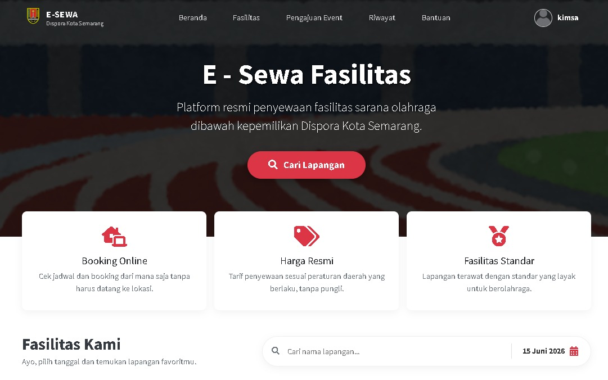
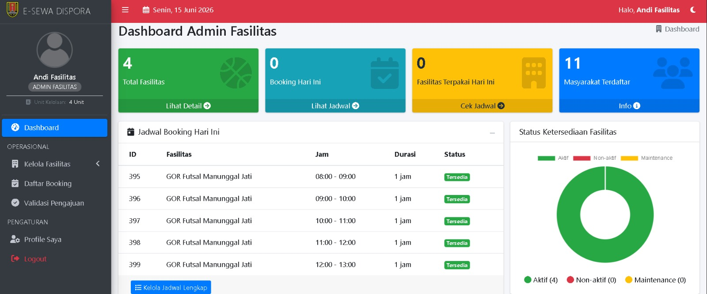
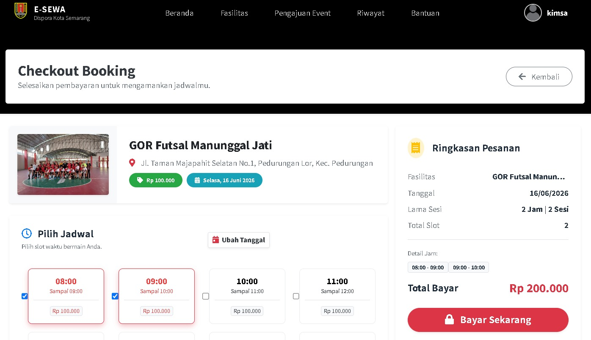

# E-Sewa

Sistem Informasi Penyewaan Fasilitas Olahraga berbasis web yang dikembangkan untuk membantu digitalisasi proses reservasi, pengelolaan jadwal, verifikasi pembayaran, dan pelaporan keuangan pada instansi pengelola fasilitas olahraga.

## 📖 Project Overview

E-Sewa dikembangkan sebagai proyek pengembangan sistem informasi untuk mengatasi berbagai permasalahan pada proses penyewaan fasilitas olahraga yang masih dilakukan secara manual, seperti:

* Jadwal pemakaian yang sering bertabrakan (*double booking*)
* Proses verifikasi pembayaran yang lambat
* Sulitnya melakukan monitoring transaksi
* Pelaporan keuangan yang kurang terintegrasi
* Pengelolaan data fasilitas yang tidak terpusat

Melalui sistem ini, seluruh proses penyewaan dapat dilakukan secara terintegrasi dalam satu platform berbasis web.

---

## 🎯 Key Features

### User

* Melihat katalog fasilitas olahraga
* Melakukan booking fasilitas secara online
* Melihat jadwal ketersediaan fasilitas
* Mengajukan penyelenggaraan event
* Upload bukti pembayaran
* Monitoring status transaksi

### Facility Admin

* Manajemen data fasilitas olahraga
* Pengaturan tarif penyewaan
* Monitoring jadwal penggunaan fasilitas
* Pengelolaan status operasional fasilitas

### Finance Admin

* Verifikasi pembayaran pengguna
* Monitoring transaksi
* Dashboard pendapatan
* Export laporan PDF dan CSV

### Super Admin

* Manajemen akun administrator
* Monitoring aktivitas sistem
* Audit trail pengguna

---

## 🏗️ System Architecture

Sistem dibangun menggunakan arsitektur MVC (Model-View-Controller) dengan Laravel Framework.

### Backend

* Laravel 12
* Laravel Jetstream
* Laravel Fortify

### Frontend

* Blade Template Engine
* Tailwind CSS
* Bootstrap 4
* AdminLTE 3

### Database

* MySQL

### Supporting Libraries

* Carbon
* Chart.js
* DomPDF
* Laravel Excel

---

## 🗄️ Main Modules

### Booking Management

Mengelola proses pemesanan fasilitas olahraga termasuk validasi jadwal dan status transaksi.

### Event Management

Mengelola pengajuan penggunaan fasilitas untuk kegiatan atau event skala besar.

### Payment Verification

Mengelola proses pembayaran mulai dari DP hingga pelunasan.

### Financial Reporting

Menghasilkan laporan transaksi dan statistik pendapatan.

### User & Role Management

Mengatur hak akses berdasarkan role pengguna.

---

## 📊 Development Approach

Pengembangan sistem dilakukan menggunakan pendekatan **Scrum Framework** dengan tahapan:

1. Product Backlog
2. Sprint Planning
3. Sprint Development
4. Sprint Review
5. Sprint Retrospective

Metodologi ini digunakan untuk memastikan proses pengembangan berjalan secara iteratif dan terukur.

---

## 📸 Application Preview

### Landing Page



### Admin Dashboard



### Booking Page



---

## 🚀 Installation

### Clone Repository

```bash
git clone https://github.com/username/e-sewa.git
cd e-sewa
```

### Install Dependencies

```bash
composer install
npm install
```

### Environment Setup

```bash
cp .env.example .env
```

Configure database credentials inside `.env`.

### Generate Application Key

```bash
php artisan key:generate
```

### Run Migration & Seeder

```bash
php artisan migrate --seed
```

### Create Storage Link

```bash
php artisan storage:link
```

### Run Development Server

```bash
npm run dev
php artisan serve
```

Application will be available at:

```text
http://127.0.0.1:8000
```

---

## 👨‍💻 Developer Contribution

This project was developed as part of an academic software engineering project and serves as a portfolio project demonstrating competencies in:

* Full Stack Web Development
* Laravel Application Development
* Database Design
* Authentication & Authorization
* Scrum-Based Software Development
* Financial Reporting System Development

---

## 📄 License

Distributed under the MIT License.
